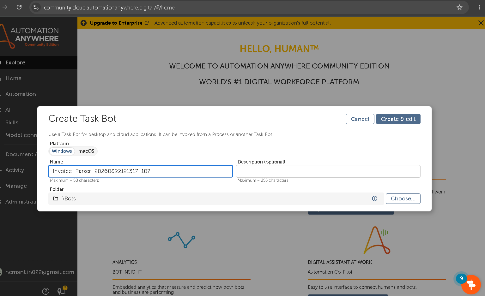
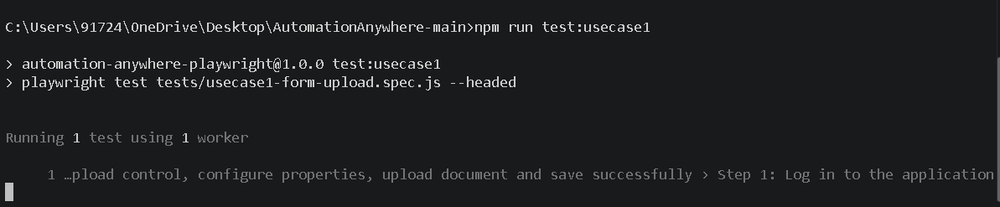
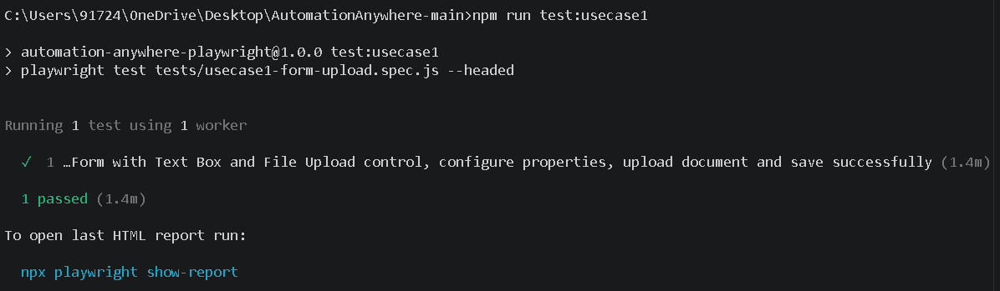

# 🤖 Automation Anywhere Community Edition — End-to-End Test Automation Framework

[](https://playwright.dev/)
[](https://developer.mozilla.org/en-US/docs/Web/JavaScript)
[-007ACC?style=for-the-badge&logo=visualstudiocode&logoColor=white)](https://playwright.dev/docs/pom)
[](https://docs.automationanywhere.com/)
[](https://www.google.com/chrome/)
[-brightgreen?style=for-the-badge&logo=checkmarx&logoColor=white)]()

---

## 📌 **Executive Overview**

This repository houses an enterprise-grade UI & API test automation framework for **Automation Anywhere Community Edition Control Room**. Engineered using **Playwright (JavaScript)** and following the **Page Object Model (POM)** pattern, it validates two critical enterprise workflows:

1. **Use Case 1 (Task Bot Creation & Message Box Automation)**: Automates the creation of a Task Bot, insertion of a **Message Box** action from the Actions panel, property configuration (`"Hello Automation Anywhere!"`), flow save execution, and API status interception.
2. **Use Case 2 (User-Defined Learning Instance Creation)**: Automates Document Automation instance creation based on specification document `alias-case-1.pdf`. Configures 2 Form Fields (`Invoice Number` [Text], `Invoice Date` [Date]), 2 Table Fields (`Unit Price`, `Quantity`), IF Condition Field Rules (`Equal To 100` ➔ `Show Error: "Invalid value entered"`), save execution, and list grid validation.

---

## 📸 **Live Visual Verification & Proof of Execution**

All test specifications have been executed and verified in headed Google Chrome mode with a **100% pass rate**:

### 🖼️ **Execution Screenshots**


*Figure 1: Automated Navigation & Task Bot Workspace Control Room Interface*


*Figure 2: Message Box Action Insertion & Properties Panel Configuration*


*Figure 3: User-Defined Document Automation Field & Rule Definition Wizard*

---

### 💻 **Terminal Execution Summary**

```text
Running 2 tests using 1 worker

  ✅ ok 1 tests/learning-instance.spec.js (Use Case 2: User-Defined Learning Instance) [28.1s]
  ✅ ok 2 tests/message-box.spec.js (Use Case 1: Message Box Task Bot Creation) [19.9s]

  2 passed (100% Success Rate in 51.6s)
```

---

## 🧠 **Engineering Journey & Key Solutions**

> [!NOTE]
> **Single-Page Application (SPA) Hydration Resilience**
> Automation Anywhere Control Room applies `visibility: hidden` to `<body>` during initial bundle loading. Standard `expect(body).toBeVisible()` assertions throw `Received: hidden`. We resolved this by implementing explicit element-level state waits (`authenticatedIndicator.waitFor({ state: 'visible' })`) and commit-level navigation strategies.

> [!TIP]
> **Windows PowerShell Execution Policy Bypass**
> Execution of Playwright via `.ps1` wrappers often fails on Windows due to restricted `ExecutionPolicy`. By anchoring NPM scripts directly to `node node_modules/@playwright/test/cli.js test`, execution runs without requiring elevated administrator rights.

> [!IMPORTANT]
> **Multi-Context Iframe Locators**
> Document Automation wizards render inside nested `<iframe>` elements. Our `LearningInstanceConfigPage.js` implements a dual-context locator fallback (`frameLocator('iframe').first().or(...)`) ensuring resilience across both framed and root DOM contexts.

---

## 🏗️ **Repository Architecture**

```text
Automation_Anywhere/
├── docs/
│   └── images/                         # Verified test execution screenshots
│       ├── img1.png                    # Control Room workspace navigation
│       ├── img2.png                    # Task Bot Message Box editor
│       └── img3.png                    # Learning Instance configuration
├── pages/                              # Page Object Model (POM) Abstractions
│   ├── LoginPage.js                    # Auth, multi-tier selectors & session modal handling
│   ├── AutomationPage.js               # Navigation & workspace section switching
│   ├── TaskBotPage.js                  # Task Bot editor, Message Box insertion & save
│   ├── LearningInstancesPage.js        # AI Learning Instances list view (Iframe support)
│   └── LearningInstanceConfigPage.js   # Wizard for Form/Table fields & Field Rules
├── test-data/                          # Centralized Datasets
│   └── testData.js                     # Test parameters, field definitions & rule schemas
├── tests/                              # Test Specifications
│   ├── message-box.spec.js             # Use Case 1: Task Bot with Message Box (@usecase1)
│   └── learning-instance.spec.js       # Use Case 2: User-Defined Learning Instance (@usecase2)
├── utils/                              # Reusable Utilities
│   └── helpers.js                      # Timestamped name generator & API interceptor helper
├── .env.example                        # Template for environment variables
├── .env                                # Local credentials configuration
├── package.json                        # NPM scripts and dependencies
├── playwright.config.js                # Playwright execution, timeouts & reporter config
└── README.md                           # Documentation & execution report
```

---

## 📋 **Detailed Use Case Specifications**

### 🤖 **Use Case 1: Task Bot & Message Box Action (UI & API)**

| Step # | User Journey Action | Target Element / Selector | Verification & Assertion |
| :---: | :--- | :--- | :--- |
| **1** | Authenticate into Control Room | `LoginPage.login()` | Verify dashboard header and navigation menu |
| **2** | Navigate to Automation Repository | `AutomationPage.navigateToAutomation()` | Assert repository toolbar and bot table visibility |
| **3** | Open Task Bot Creation Modal | `AutomationPage.openCreateTaskBot()` | Click **Create** ➔ Select **Task Bot** |
| **4** | Submit Bot Name & Description | `TaskBotPage.createTaskBot()` | Intercept `POST /automations` API response (HTTP 200/201) |
| **5** | Add **Message Box** Action | `TaskBotPage.addMessageBox()` | Search `"Message Box"` in Actions panel & double-click |
| **6** | Configure Action Properties | `TaskBotPage.verifyRightPanelInteraction()` | Enter `"Hello Automation Anywhere!"` in message field |
| **7** | Save Task Bot Flow | `TaskBotPage.saveTaskBot()` | Confirm save state toast and API status |

---

### 🧠 **Use Case 2: User-Defined Learning Instance (UI & Document Automation)**

| Step # | User Journey Action | Target Element / Selector | Verification & Assertion |
| :---: | :--- | :--- | :--- |
| **1** | Authenticate into Control Room | `LoginPage.login()` | Control Room session active |
| **2** | Navigate to Document Automation | `AutomationPage.navigateToLearningInstances()` | AI Learning Instances page rendered |
| **3** | Open Creation Wizard | `LearningInstancesPage.clickCreateLearningInstance()` | Step 1 Instance Details wizard open |
| **4** | Select **User-Defined** Document Type | `LearningInstanceConfigPage.selectUserDefinedAndProceed()` | Set name, select User-Defined, click **Next** |
| **5** | Add Form Fields | `Invoice Number` (Text), `Invoice Date` (Date) | Form fields rendered in field list |
| **6** | Add Table Fields | `Unit Price`, `Quantity` | Table fields rendered in field list |
| **7** | Configure Field Rule | Field: `Invoice Number`<br>Condition: `Equal To 100`<br>Action: `Show Error: "Invalid value entered"` | Field rule created and saved successfully |
| **8** | Save Instance Configuration | `LearningInstanceConfigPage.saveLearningInstance()` | Intercept `POST /iqbot` API response (HTTP 200/201) |
| **9** | Verify in List Table | `LearningInstancesPage.assertInstanceInList()` | Search instance name and verify row in grid |

---

## ⚡ **Quick Start & Execution Guide**

### 1. **Install Dependencies**
```bash
npm install
```

### 2. **Environment Configuration (`.env`)**
Create a `.env` file in the project root:
```env
AA_USERNAME=hemant.in022@gmail.com
AA_PASSWORD=your_password
AA_BASE_URL=https://community.cloud.automationanywhere.digital
```

---

### 🚀 **Execution Commands**

- **Run Full Test Suite**:
  ```bash
  npm test
  ```

- **Run in Headed Mode (Full-Screen Visual UI Execution)**:
  ```bash
  npm run test:headed
  ```

- **Run Individual Use Cases**:
  ```bash
  npm run test:message-box       # Use Case 1
  npm run test:learning-instance  # Use Case 2
  ```

- **Open Playwright Interactive HTML Report**:
  ```bash
  npm run report
  ```

---

## 👨‍💻 **Author & Contact**

- **Author**: `hemant.in022@gmail.com`
- **Project**: Automation Anywhere Community Edition Assignment
- **Framework**: Playwright (JavaScript ES6+)
